# Chat Us

## Description

Chat Us is a chat application which follows MVC architecture. It uses parse open source for storing data via back4app platform. It uses parse server for authentication and registeration. The user has to verify his/her
email after registering new account. The user can upload or update all profile details of the user. It also allows the user to create and share photos. The user is allowed to follow or unfollow other users. The user can see
 other user's posts after following him/her. The user can allow or deny access to chat.

There are a lot of messaging applications in the market. As of October 19, the most used messaging apps are whatsapp with 1.6
billion users, facebook messenger with 1.3 billion users, and wechat with 1.1 billion. There are only 25 countries in the world where whatsapp is not the market leader in messaging apps 
and only 10 countries where the leading messenger app is not owned by facebook. New messaging apps are being developed and released everyday. Messaging is done realtime and all the messages
are encrypted. Almost all the messaging apps ensure data security. 

The primary motivation in building this application to make use of parse server to build chat application.

## Application Screenshots

* Splash Screen:
   

   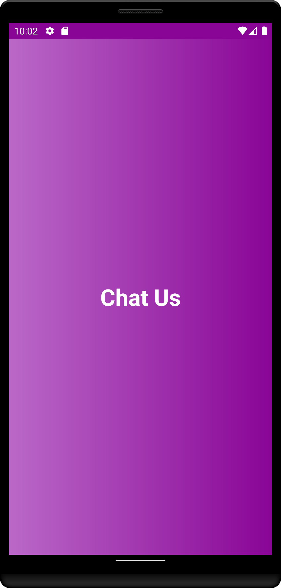
   

   
* The user will be presented with the authentication screen from which the user can login and register.

  - **Login Screen:** The user can login by entering proper login credentials. 
  

  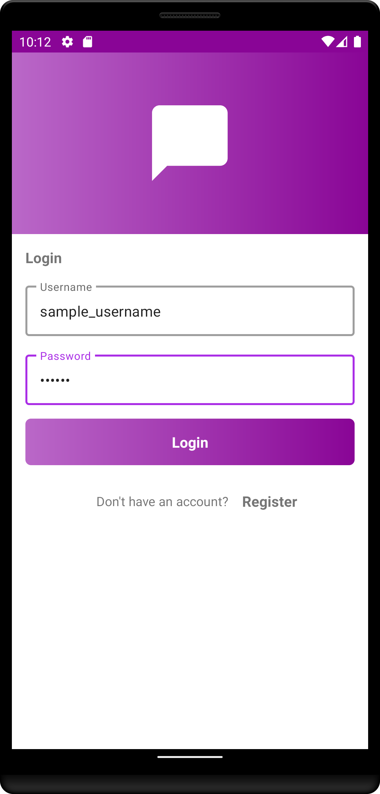
  

  
  - **Register Screen:** A new account can be created by entering all the necessary details.
  

  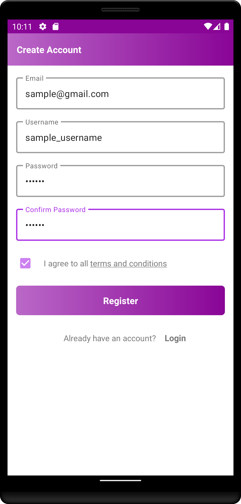
  

   
* After authentication or registeration of user, the user will be presented with main screen which shows details, friends or posts of the user.
  - **User Details Screen:** It shows details of the user.
  

  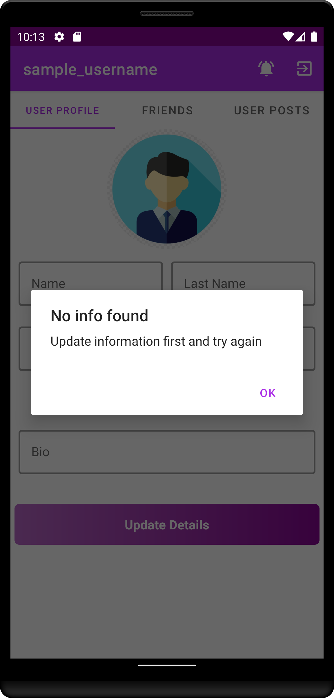 &nbsp; &nbsp; &nbsp; &nbsp; &nbsp;
  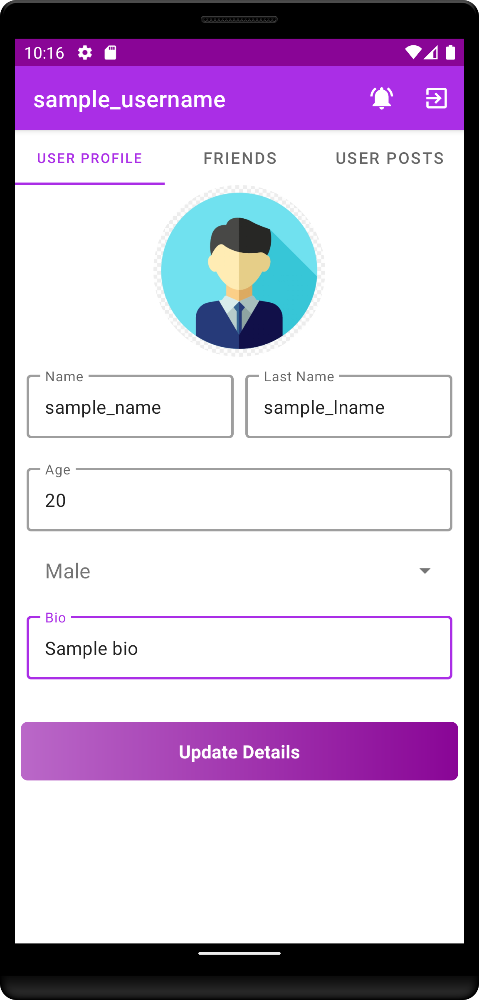 &nbsp; &nbsp; &nbsp; &nbsp; &nbsp;
  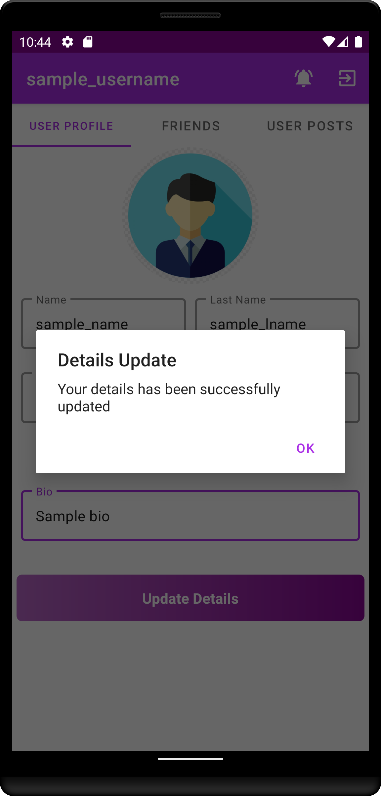
  

  
  - **Friends Screen:** It shows list of friends of the user.
      

      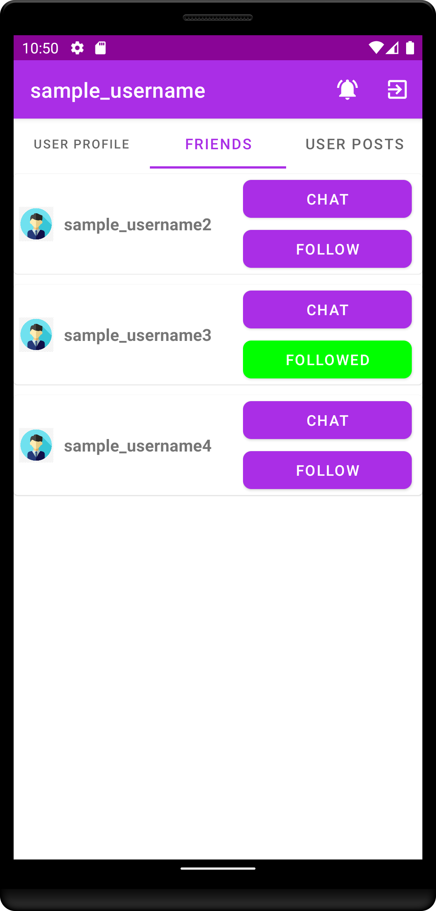 &nbsp; &nbsp; &nbsp; &nbsp; &nbsp;
      

  
  - **Account Details Screen:** It shows details of the user account.
   

   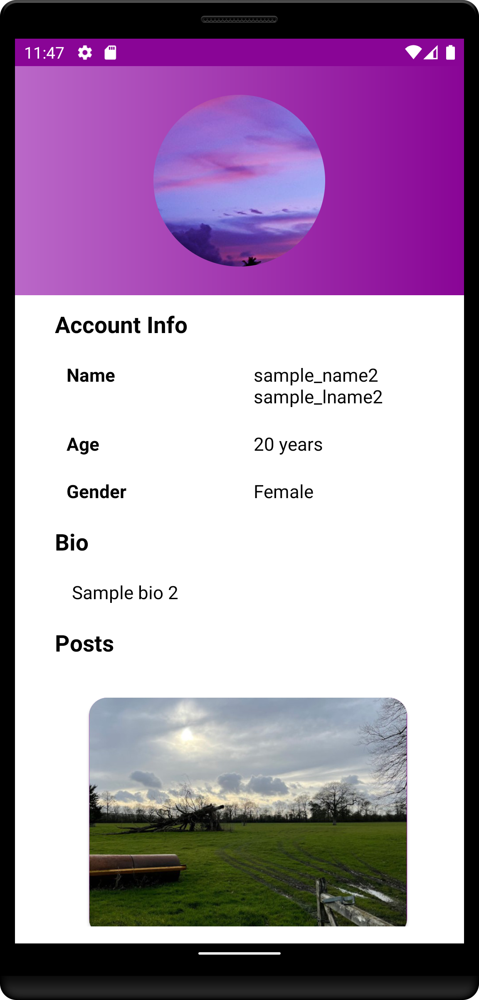 &nbsp; &nbsp; &nbsp; &nbsp; &nbsp;
   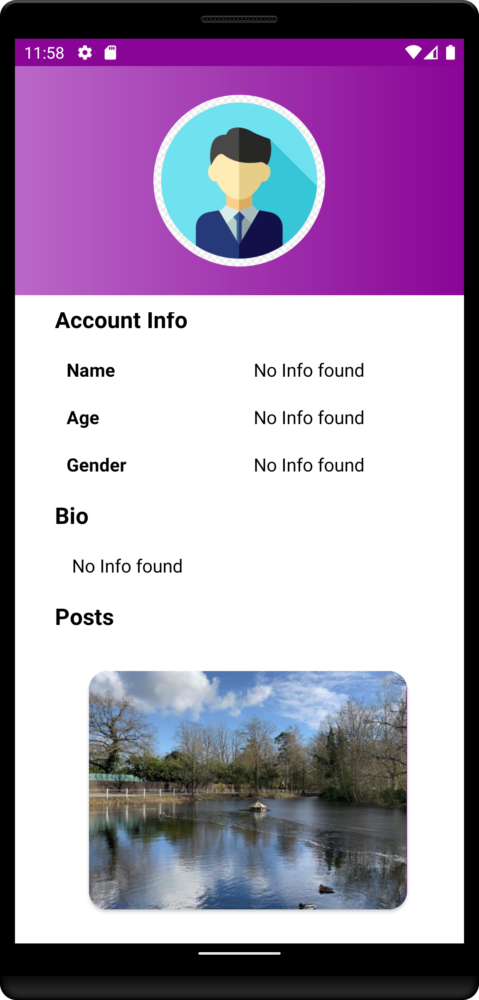
   

  
  - **User Posts Screen:** The user can add or see posts of the user and his/her friends.
   

   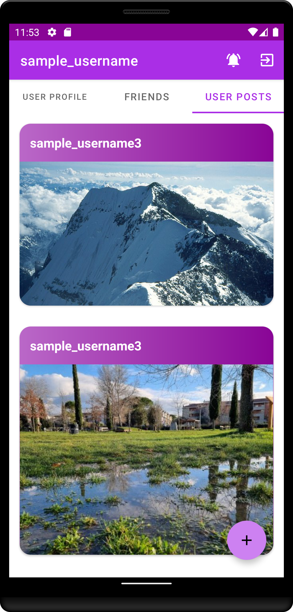
   

  
* Requests Screen: It shows requests of all the user which sent the requests to chat with the current user. The requests can be denied or accepted.
   

   
   

  
* Logout Screen: Logouts the user.
   

   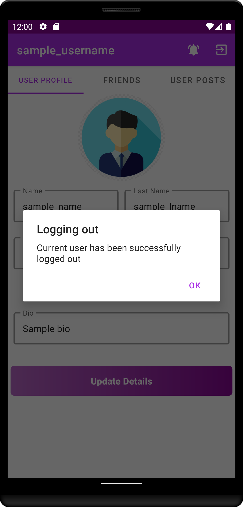
   

