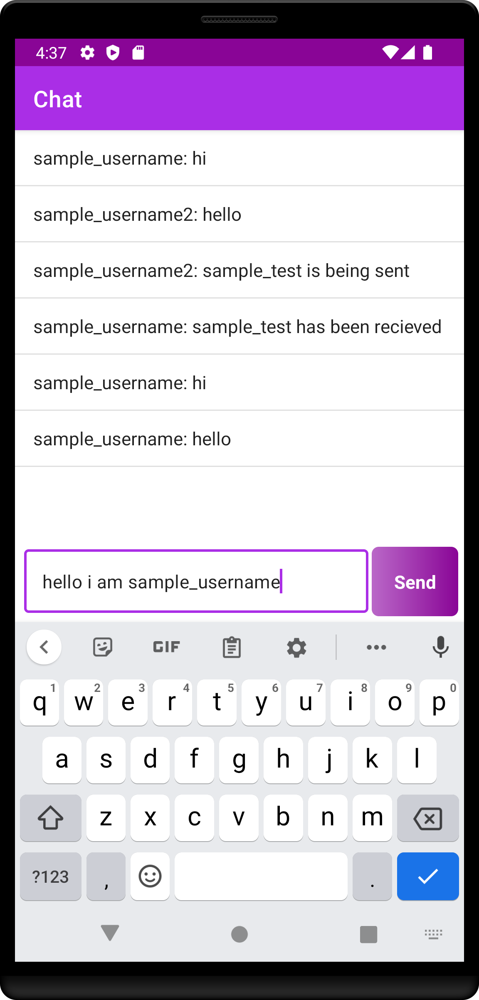
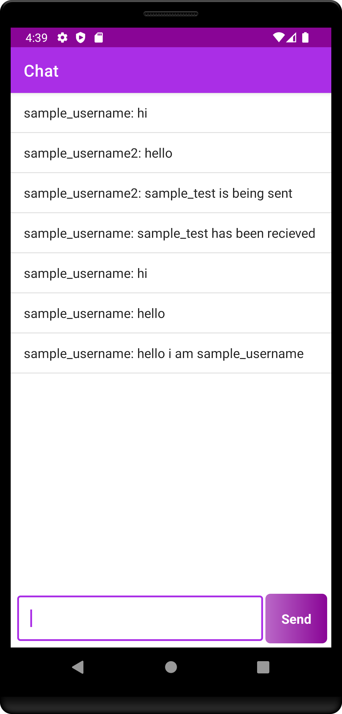
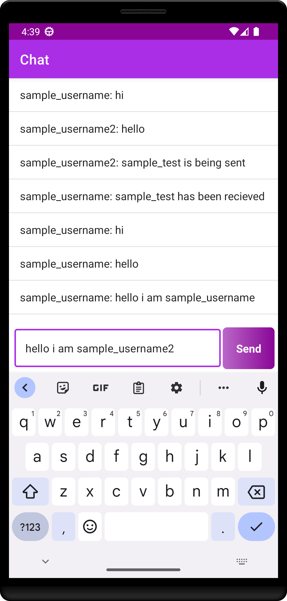
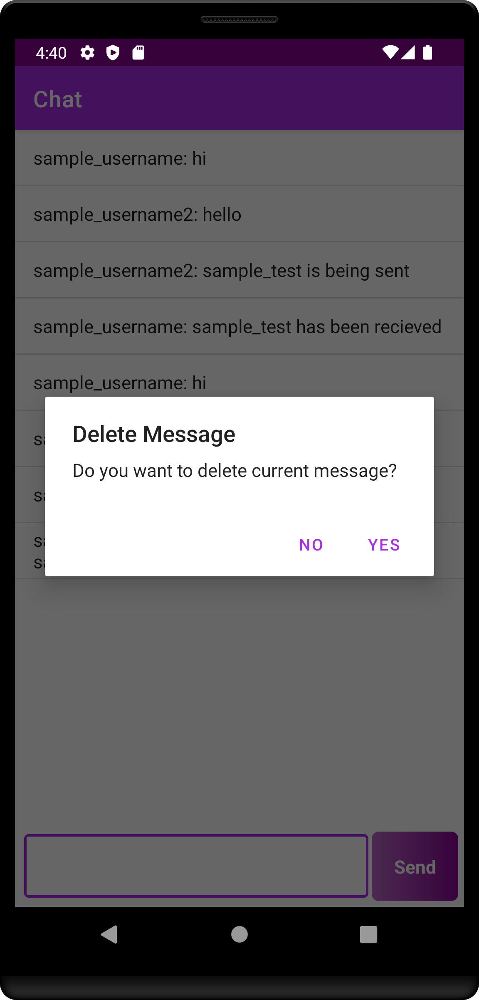
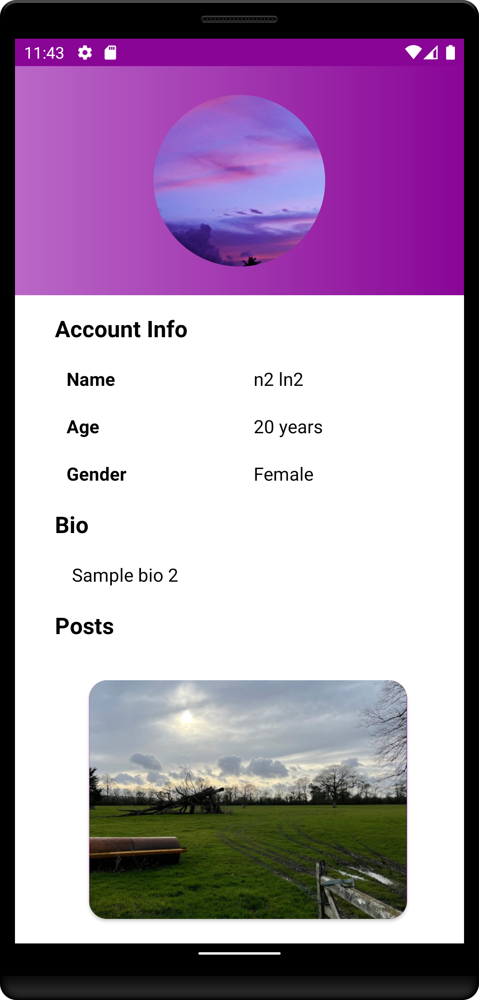

# Chat Us

## Description

Chat Us is a chat application which follows MVC architecture. It uses parse open source for storing data via back4app platform. It uses parse server for authentication and registeration. The user has to verify his/her
email after registering new account. The user can upload or update all profile details of the user. It also allows the user to create and share photos. The user is allowed to follow or unfollow other users. The user can see
 other user's posts after following him/her. The user can allow or deny access to chat.

There are a lot of messaging applications in the market. As of October 19, the most used messaging apps are whatsapp with 1.6
billion users, facebook messenger with 1.3 billion users, and wechat with 1.1 billion. There are only 25 countries in the world where whatsapp is not the market leader in messaging apps 
and only 10 countries where the leading messenger app is not owned by facebook. New messaging apps are being developed and released everyday. Messaging is done realtime and all the messages
are encrypted. Almost all the messaging apps ensure data security. 

The primary motivation in building this application to make use of parse server to build chat application.

## Application Screenshots

* Splash Screen:
   

   
   

   
* The user will be presented with the authentication screen from which the user can login and register.

  - **Login Screen:** The user can login by entering proper login credentials. 
  

  
  

  
  - **Register Screen:** A new account can be created by entering all the necessary details.
  

  
  

   
* After authentication or registeration of user, the user will be presented with main screen which shows details, friends or posts of the user.
  - **User Details Screen:** It shows details of the user.
  

   &nbsp; &nbsp; &nbsp; &nbsp; &nbsp;
   &nbsp; &nbsp; &nbsp; &nbsp; &nbsp;
  
  

  
  - **Friends Screen:** It shows list of friends of the user.
      

       &nbsp; &nbsp; &nbsp; &nbsp; &nbsp;
      

      
  - **Realtime Chat Screen:** It provides the ability to chat with other user realtime
      

       &nbsp; &nbsp; &nbsp; &nbsp; &nbsp;
       &nbsp; &nbsp; &nbsp; &nbsp; &nbsp;
       &nbsp; &nbsp; &nbsp; &nbsp; &nbsp;
       &nbsp; &nbsp; &nbsp; &nbsp; &nbsp;
      

  
  - **Account Details Screen:** It shows details of the user account.
   

   
   

  
  - **User Posts Screen:** The user can add or see posts of the user and his/her friends.
   

   
   

  
* Requests Screen: It shows requests of all the user which sent the requests to chat with the current user. The requests can be denied or accepted.
   

   
   

  
* Logout Screen: Logouts the user.
   

   
   

## Code Structure

Chat Us implements MVC pattern which has following three layers: 

* Model: It represents the business layer of the application. Our application stores various models such as ChatStatus, User and UserPost.
* View: It defines the presentation of application. The user can login via LoginActivity and register via RegisterActivity. The user can chat via ChatActivity. All the requests can be seen in RequestsActivity. The user can see user details of any other user. The user can set his/her user details in the UserProfileFragment. The user can add post, see posts or other users' posts in the UserPostsFragment. The user can follow any other user in UsersFragment.
* Controller: It manages the flow of application. Our application consists of  lot of adapters which deal with list of data and update recycler views.

## Package Structure

    com.example.instagramcloneapp      # Root Package
      .
      ├── activities                   # Contains various activities to login, register, chat, see requests, see user details of other users and logout.
      ├── controller                   # Contains adapters to manage the flow of the application.
      ├── fragments                    # Contains UserPostsFragment to add or see user posts, UserProfileFragment to set profile details of the user and UsersFragment to follow other users or send requests to chat.
      ├── model                        # Contains various model classes to implement business layer of the application.
      ├── views                        # Contains various viewholders for the adapter.
      └── App                          # It initialises Parse.
      
## Technologies and Libraries
- [Java](https://docs.oracle.com/en/java/javase/11/) - Java is a high-level, class-based, object-oriented programming language that is designed to have as few implementation dependencies as possible.
- [Parse Android SDK](https://www.back4app.com/docs/android/parse-android-sdk) - Parse is an open-source Android SDK and back-end solution that enables developers to build mobile apps with shared data quickly and without writing any back-end code or custom APIs. 
- [Parse Live Query](https://www.back4app.com/docs/android/real-time/live-query) - Live queries are meant to be used in real-time reactive applications, where just using the traditional query paradigm would come with some problems, like increased response time and high network and server usage. 
- [Image Cropper](https://github.com/ArthurHub/Android-Image-Cropper) - Powerful (Zoom, Rotation, Multi-Source), customizable (Shape, Limits, Style), optimized (Async, Sampling, Matrix) and simple image cropping library for Android.
- [Circle Image View](https://github.com/hdodenhof/CircleImageView) - A fast circular ImageView perfect for profile images. This is based on RoundedImageView from Vince Mi which itself is based on techniques recommended by Romain Guy.

## Built With

* Android Studio

## Author
* <a href="https://github.com/aikansh2001yadav"> **Aikansh Yadav** </a>
